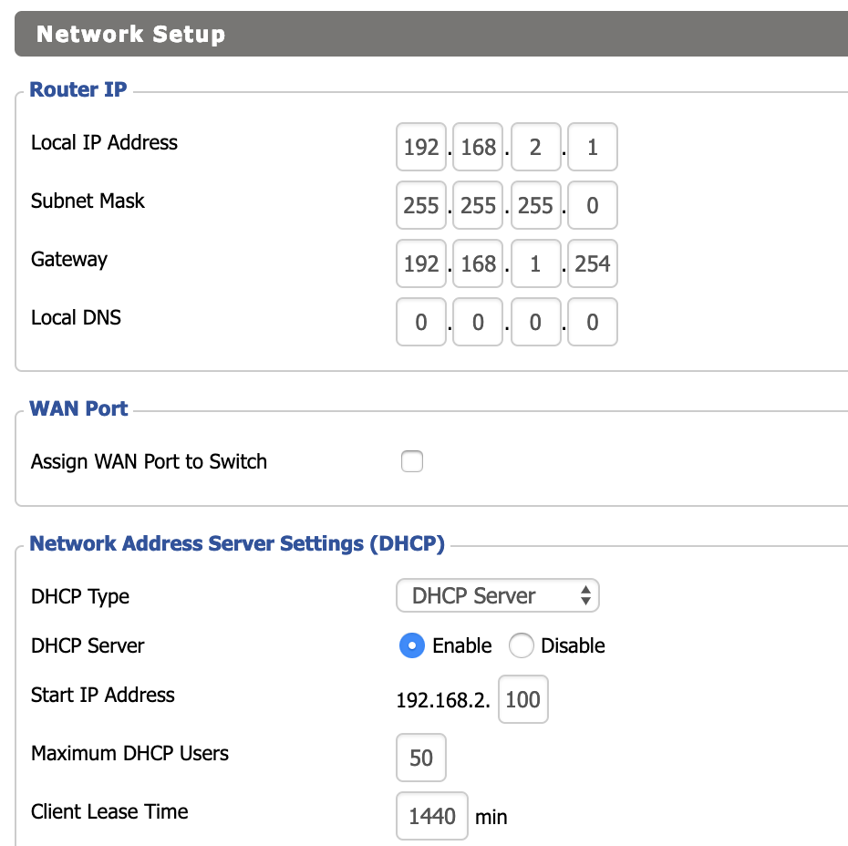
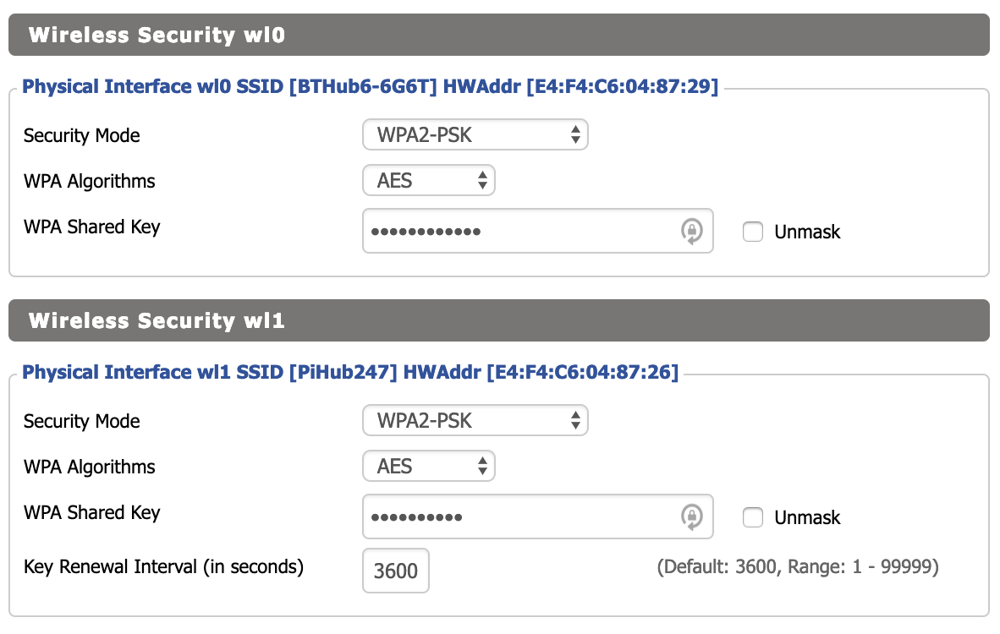

# Pi3 Hardware Setup

This is to document my home pi3 cluster setup when using HypriotOS and Rak8s.

# Network Setup

First step is to ensure we have a network that the pis can utilise.

The `cloud-config.yml` files configure the wlan0 adapter on each of the raspberry pis.  Each pi will connect to the WLAN Router which supplies the SSID `PiHub247`. Our network layout should be as follows:

| IP                                   | Device              |
| ------------------------------------ | ---------------     |
| `192.168.1.254`                      | Home Internet Router|
| `192.168.2.1`                        | WLAN Router (dd-wrt)|
| `192.168.2.200`                      | rak8s000 (master)   |
| `192.168.2.201`                      | rak8s001 (node01)   |
| `192.168.2.202`                      | rak8s002 (node02)   |
| `192.168.2.203`                      | rak8s003 (node03)   |


## DD-WRT WLAN Router

Initially we need to ensure the DDWRT router is set to `192.168.2.1` with
the gateway set to the router with internet access `192.168.1.254`.  The DHCP Server is enabled so I can test out connecting to `PiHub247`.



In the `wireless` tab we set the wireless mode of the `wl0` to `Client` to connect to the home router - in this case my home router is called
 `BTHub6-6G6T`.

 We then set the `wl1` interface to act as an Access Point (AP) with the name `PiHub247` so the raspberry pis can connect to this router.


Next we add the wireless passwords in the security settings.  I have set the PiHub247 password to be `b4k3m3aPIE`. :)



## /etc/hosts file

On the ansible host/laptop I have the following `/etc/hosts` file.

```
127.0.0.1   localhost localhost.localdomain localhost4 localhost4.localdomain4
::1         localhost localhost.localdomain localhost6 localhost6.localdomain6

192.168.2.201 hello-nodejs.rak8s001
192.168.2.200 rak8s000 rak8s000
192.168.2.201 rak8s001 rak8s001
192.168.2.202 rak8s002 rak8s002
192.168.2.203 rak8s003 rak8s003
```

# Operating System Install : SD Card Setup

Here we will get HypriotOS installed on the SD cards!  For more information please read the Hypriot blog @  https://blog.hypriot.com/

Install Hypriot's [flash](https://github.com/hypriot/flash) as per the details on GitHub:
```
curl -LO https://github.com/hypriot/flash/releases/download/2.3.0/flash
chmod +x flash
sudo mv flash /usr/local/bin/flash
```

Download the hypriotOS image and unzip:

```
curl -L https://github.com/hypriot/image-builder-rpi/releases/download/v1.10.0/hypriotos-rpi-v1.10.0.zip -o hypriotos-rpi-v1.10.0.zip

unzip hypriotos-rpi-v1.10.0.zip
```

Modify the `*-cloud-config.yml` files accordingly.  The only thing I have removed is my SSH KEY `YOUR_SSH_KEY`.  View the files to inspect the configuration.

Flash the data onto 4 SD cards (one at a time surely):

```bash
flash --userdata rak8s000-cloud-config.yml hypriotos-rpi-v1.10.0.img
flash --userdata rak8s001-cloud-config.yml hypriotos-rpi-v1.10.0.img
flash --userdata rak8s002-cloud-config.yml hypriotos-rpi-v1.10.0.img
flash --userdata rak8s003-cloud-config.yml hypriotos-rpi-v1.10.0.img
```

Insert your SD cards into your pis and you should have a bunch of ssh accessible pi's.

```
user: pirate
password: hypriot
```

# Running the playbooks

The playbooks should perform the following:

- Create the kubernetes cluster
- Add Ingress to the cluster
- Create a sample nodejs app

Once done you should be able to access the nodejs app at [http://hello-nodejs.rak8s001](http://hello-nodejs.rak8s001)

```
ansible-playbook cluster.yml
ansible-playbook dashboard.yml
ansible-playbook ingress.yml

```

