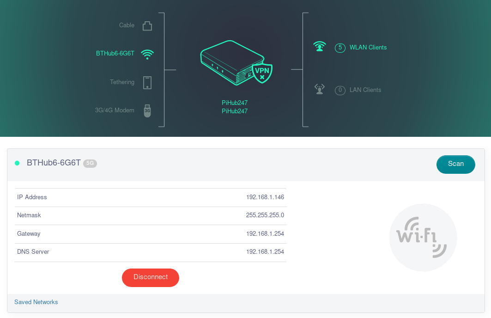

# Pi3 Hardware Setup

This is to document my home pi3 cluster setup when using HypriotOS and Rak8s.

## My Shopping List

- MicroSD Cards (x4) - https://www.amazon.co.uk/Samsung-32GB-Memory-Micro-Adapter/dp/B06XFSZGCC/ref=sr_1_3?crid=20EE3ZPU4Q6LW&keywords=samsung+32gb+micro+sd+card&qid=1553088617&s=computers&sprefix=samsung+32gb+m%2Ccomputers%2C438&sr=1-3
- Raspberry Pis 3 B+ (x4) - https://www.amazon.co.uk/gp/product/B07BDR5PDW/ref=ppx_yo_dt_b_asin_title_o01_s00?ie=UTF8&psc=1
- GL.iNet GL-AR750 Travel AC Router https://www.amazon.co.uk/gp/product/B07712LKJM/ref=ppx_yo_dt_b_asin_title_o01_s00?ie=UTF8&psc=1
- 5 Pack of USB Power Cords https://www.amazon.co.uk/gp/product/B07MS8R781/ref=ppx_yo_dt_b_asin_title_o01_s00?ie=UTF8&psc=1
- Stackable Pi Case https://www.amazon.co.uk/gp/product/B07BGWNWWR/ref=ppx_yo_dt_b_asin_title_o01_s00?ie=UTF8&psc=1
- AUKEY Quick Charge 3.0 5-Port USB Charger https://www.amazon.co.uk/gp/product/B01ENBZJ5M/ref=oh_aui_search_asin_title?ie=UTF8&psc=1

All available in this Amazon ideas list: https://www.amazon.co.uk/ideas/amzn1.account.AHAAOWHYGSTZ5JMHCNIOS2C4TAZQ/3OHL05AL7OSAA

Price varies but comes to around £250.

# Network Setup

First step is to ensure we have a network that the pis can utilise.

The `cloud-config.yml` files configure the wlan0 adapter on each of the raspberry pis.  Each pi will connect to the WLAN Router which supplies the SSID `PiHub247`. Our network layout should be as follows:

| IP                                   | Device              |
| ------------------------------------ | ---------------     |
| `192.168.1.254`                      | Home Internet Router |
| `192.168.2.1`                        | WLAN Router (GL.iNet)|
| `192.168.2.200`                      | rak8s000 (master)   |
| `192.168.2.201`                      | rak8s001 (node01)   |
| `192.168.2.202`                      | rak8s002 (node02)   |
| `192.168.2.203`                      | rak8s003 (node03)   |


## GL.iNet GL-AR750 Travel AC Router Settings

This travel router comes with a simple interface on top of OpenWRT which made it super easy to configure.

Initially we need to ensure the GL.iNet router is set to `192.168.2.1`.  Default is `192.168.8.1` on this device.


I then connected it up as a repeater to my home network.  The travel router automatically gets assigned an IP from my home router DHCP and configures the DNS/Gateway.



Next we change the wireless configuration/passwords in the wireless settings.  I disabled the 2.4Ghz band and I have set the PiHub247 password to be `b4k3m3aPIE`. :)


## /etc/hosts file

On the ansible host/laptop I have the following `/etc/hosts` file.

```
127.0.0.1   localhost localhost.localdomain localhost4 localhost4.localdomain4
::1         localhost localhost.localdomain localhost6 localhost6.localdomain6

192.168.2.201 hello-nodejs.rak8s001
192.168.2.200 rak8s000 rak8s000
192.168.2.201 rak8s001 rak8s001
192.168.2.202 rak8s002 rak8s002
192.168.2.203 rak8s003 rak8s003
```

# Operating System Install : SD Card Setup

Here we will get HypriotOS installed on the SD cards!  For more information please read the Hypriot blog @  https://blog.hypriot.com/

Install Hypriot's [flash](https://github.com/hypriot/flash) as per the details on GitHub:
```
curl -LO https://github.com/hypriot/flash/releases/download/2.3.0/flash
chmod +x flash
sudo mv flash /usr/local/bin/flash
```

Download the hypriotOS image and unzip:

```
curl -L https://github.com/hypriot/image-builder-rpi/releases/download/v1.10.0/hypriotos-rpi-v1.10.0.img.zip -o hypriotos-rpi-v1.10.0.zip
unzip hypriotos-rpi-v1.10.0.zip
```

Modify the `*-cloud-config.yml` files accordingly.  The only thing I have removed is my SSH KEY `YOUR_SSH_KEY`.  View the files to inspect the configuration.

Flash the data onto 4 SD cards (one at a time surely):

```bash
flash --userdata rak8s000-cloud-config.yml hypriotos-rpi-v1.10.0.img
flash --userdata rak8s001-cloud-config.yml hypriotos-rpi-v1.10.0.img
flash --userdata rak8s002-cloud-config.yml hypriotos-rpi-v1.10.0.img
flash --userdata rak8s003-cloud-config.yml hypriotos-rpi-v1.10.0.img
```

Insert your SD cards into your pis and you should have a bunch of ssh accessible pi's.

```
user: pirate
password: hypriot
```

# Running the playbooks

The playbooks should perform the following:

- Create the kubernetes cluster
- Add Ingress to the cluster
- Create a sample nodejs app

Once done you should be able to access the nodejs app at [http://hello-nodejs.rak8s001](http://hello-nodejs.rak8s001)

```
ansible-playbook cluster.yml --ask-become-pass -u pirate
```

After this is done you should be able to login to the cluster and run kube commands:

```
[user@user-H61H2-LM3 rak8s]$ ssh pirate@192.168.2.200
Linux rak8s000 4.14.98-v7+ #1200 SMP Tue Feb 12 20:27:48 GMT 2019 armv7l

HypriotOS (Debian GNU/Linux 9)

The programs included with the Debian GNU/Linux system are free software;
the exact distribution terms for each program are described in the
individual files in /usr/share/doc/*/copyright.

Debian GNU/Linux comes with ABSOLUTELY NO WARRANTY, to the extent
permitted by applicable law.
Last login: Thu Mar 21 13:39:21 2019 from 192.168.2.126
HypriotOS/armv7: pirate@rak8s000 in ~
$ sudo su -
# kubectl get pods --namespace kube-system
NAME                               READY   STATUS    RESTARTS   AGE
coredns-86c58d9df4-f8rgl           0/1     Pending   0          4m2s
coredns-86c58d9df4-tkzjf           0/1     Pending   0          4m2s
etcd-rak8s000                      1/1     Running   0          5m55s
kube-apiserver-rak8s000            1/1     Running   1          5m54s
kube-controller-manager-rak8s000   1/1     Running   1          6m
kube-proxy-mtxmj                   1/1     Running   0          3m25s
kube-proxy-nccgn                   1/1     Running   0          3m30s
kube-proxy-nvnkf                   1/1     Running   1          4m2s
kube-proxy-v9t6p                   1/1     Running   0          3m27s
kube-scheduler-rak8s000            1/1     Running   1          5m53s

```

Add Dashboard, Ingress, and sample app to the cluster:

```
ansible-playbook dashboard.yml --ask-become-pass -u pirate
ansible-playbook ingress.yml --ask-become-pass -u pirate

```

Later on, increase replicas if you like:

```
kubectl scale --replicas=3 deployment/hello-nodejs
```

and run a load test:

```
siege -c 200 -t 30s http://hello-nodejs.rak8s001

...
Lifting the server siege...
Transactions:		       15674 hits
Availability:		      100.00 %
Elapsed time:		       29.09 secs
Data transferred:	        0.18 MB
Response time:		        0.37 secs
Transaction rate:	      538.81 trans/sec
Throughput:		        0.01 MB/sec
Concurrency:		      197.14
Successful transactions:       15674
Failed transactions:	           0
Longest transaction:	        3.47
Shortest transaction:	        0.07

```


# Cool Readings

- http://machinezone.github.io/research/networking-solutions-for-kubernetes/